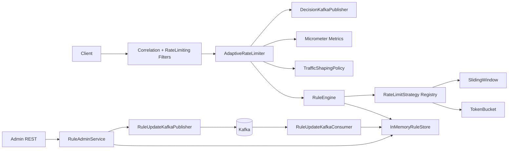
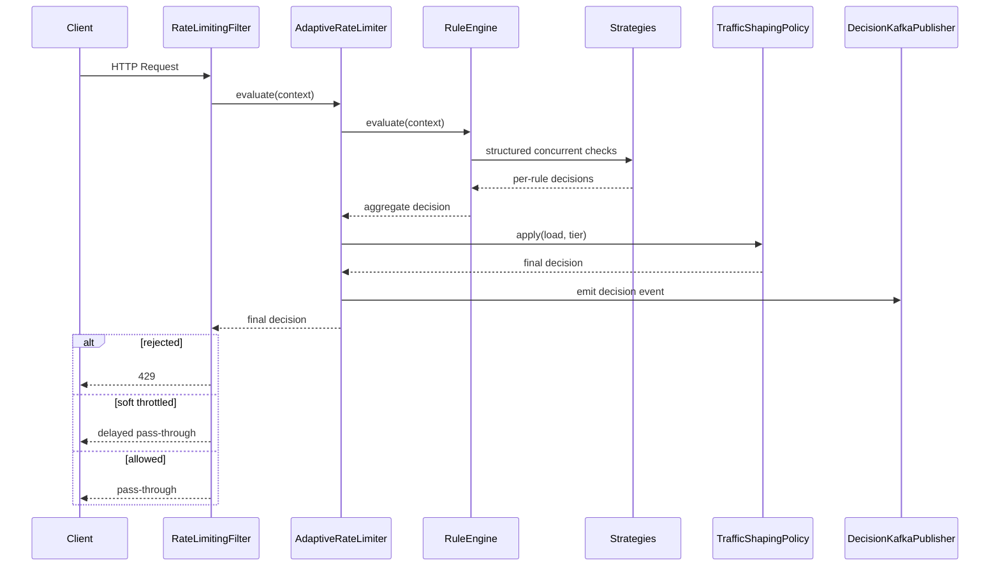
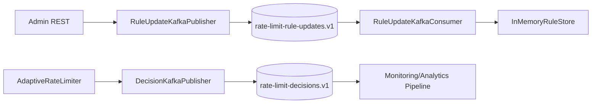

# Real-Time Adaptive Rate Limiting & Traffic Shaping Platform

Production-grade Spring Boot 3.x + Java 21 implementation of an adaptive rate limiter suitable for high-throughput backend services and interview deep-dives.

## Tech Stack

- Java 21
- Spring Boot 3.3.x
- Kafka (rule updates + decision events)
- Micrometer + Prometheus
- Virtual Threads
- Structured Concurrency (JDK 21 preview)
- In-memory rule/state stores (v1)

## Core Features

- Pluggable rate limiting algorithms:
  - Token Bucket
  - Sliding Window
- Scope coverage:
  - Per user
  - Per API
  - Per tenant
- Dynamic rule updates:
  - Admin REST APIs
  - Kafka-based update propagation
  - Live in-memory update without restart
- Traffic shaping:
  - Premium vs Free prioritization
  - Soft throttle vs hard reject
  - Load-aware decisions
- Event streaming:
  - Emits Allowed / Throttled / Rejected events to Kafka
- Observability:
  - QPS
  - Allowed/Rejected/Throttled counters
  - Decision latency (p95 via timer)
  - Correlation IDs
  - Structured logs

## High-Level Architecture



## Package Layout

```text
com.platform.ratelimiter
├── api
├── filter
├── domain
├── engine
├── strategy
├── store
├── kafka
├── metrics
├── admin
└── config
```

## Request Flow Diagram



## Kafka Flow Diagram



## Why In-Memory (No Redis) in v1

- Keeps decision path purely local for minimum latency (<5ms target).
- Eliminates network hop and distributed lock/consistency concerns in first iteration.
- Enables easier interview discussion of algorithm correctness and concurrency.
- Trade-off: state is not shared across instances; fairness is probabilistic across a fleet.

## Why Eventual Consistency for Rules

- Rule updates are distributed through Kafka fan-out.
- It avoids coordinated write barriers and allows resilient operation during broker hiccups.
- Short-lived lag is acceptable for rate-limiting policy changes.

## Horizontal Scaling Strategy

- Stateless app tier: add more instances behind L7 load balancer.
- Kafka propagates updates to all instances.
- Sticky routing (optional) improves per-user fairness with local state.
- For strict global fairness, move counters/state to shared store in v2.

## Fairness Model

- Multi-scope enforcement: user + API + tenant rules.
- Higher-priority rules dominate in conflicts.
- Premium users bypass soft throttles under pressure.
- Free users are shaped first as load approaches saturation.

## Multi-Region Evolution

- Region-local Kafka + rule topic replication.
- Region-local counters with policy convergence via replicated rule events.
- Optional global control plane for authoring rules, regional data planes for enforcement.

## Failure Scenarios

- Kafka down:
  - Decision/rule publishers enqueue events in bounded fallback queues.
  - Core rate limiting continues locally.
  - Oldest events are dropped if queue is full (graceful degradation).
- Rule lag:
  - Existing rules continue serving.
  - New rule convergence is eventual once consumer catches up.
- Instance restart:
  - In-memory counters reset.
  - Rules rehydrate from admin updates/default bootstrap; production v2 should add durable rule snapshot.

## Running Locally

```bash
./gradlew test
./gradlew bootRun
```

Default headers for test calls:

- `X-Tenant-Id`
- `X-User-Id`
- `X-User-Tier` (`FREE` or `PREMIUM`)
- `X-Correlation-ID` (optional)

## Admin APIs

- `GET /admin/v1/rules`
- `PUT /admin/v1/rules/{ruleId}`
- `DELETE /admin/v1/rules/{ruleId}`

## Notes on Structured Concurrency

`RuleEngine` uses `StructuredTaskScope` (JDK 21 preview) to evaluate matched rules concurrently with bounded and explicit lifecycle management.
